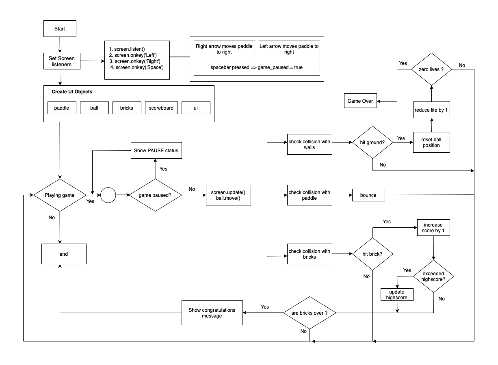

# Breakout game

## Challenge Outline
#### Summary and Review

The goal of this project is to develop an implementation of the classic arcade game Breakout using Typescript.
The Breakout game is a classic arcade game where the player controls a paddle to bounce a ball and break bricks. The objective is to clear all the bricks by hitting them with the ball without letting the ball fall off the bottom of the screen.

#### UML Diagram

Here is a UML style diagram illustrating initial overall solution logic:

#### Initial working plan

To address the challenge, the initial plan was to implement the game using an object-oriented approach. The development strategy focused on modularizing the code into separate classes for the game elements such as bricks, paddle, and ball. This approach aimed to improve code organization, reusability, and maintainability.

#### Analysis and Decomposition

The overall problem of creating the Breakout game was decomposed into several key tasks or milestones. These tasks included creating the game canvas, implementing the game elements and their behaviors, handling collisions, managing game states, and rendering graphics. This decomposition helped in managing the project by breaking down the complex problem into manageable and focused tasks.

#### Initial Object-Oriented Design

Based on the decomposition, an initial object-oriented design was planned. The game elements were represented as classes, such as `Brick`, `Paddle`, and `Ball`, which extended a common `Sprite` class. This design facilitated code reuse, encapsulation of behavior, and separation of concerns. The project was planned to be implemented in phases, with each phase targeting specific features and functionalities.

---

## Development

#### Adoption of Good Standards

Throughout my development process, good coding standards were adopted. This included writing clean and readable code, following consistent naming conventions, providing meaningful comments, and organizing the project structure. By adhering to these standards, it enabled the code to maintain a high level of quality and readability.

#### Phase 1 Development: Task, Code Review, and Changes

During the first phase of development, the game environment was set up using the `CanvasView` class. The `Ball` and `Paddle` classes were implemented to handle ball movement and paddle control. Collision detection between the ball and the paddle was implemented in the `Collision` class. Code reviews were conducted to ensure adherence to best practices, and necessary changes were made based on feedback

#### Phase 2 Development: Task, Code Review, and Changes

In subsequent development phases, additional features were implemented. This included creating bricks using the `createBricks()` function, updating the ball's position with `moveBall()`, and handling collisions with bricks using `isCollidingBricks()` in the Collision class. Each phase followed a similar pattern of defining tasks, conducting my own code reviews, and making necessary changes wherever possible.

#### Ensuring Quality and Bug Resolution
To ensure code quality, comprehensive testing was performed throughout the development process using [jest](https://jestjs.io/). It has features such as mocks and is useful for writing unit and integration tests .Various test cases were designed and executed to verify the correct behavior of the game elements and handle edge cases. Any bugs and issues  that i identified during testing were promptly resolved to maintain a stable and reliable game experience.

#### Reflection on Design Challenges

One of the key design challenges encountered was managing collision detection between the ball and the game elements. Bounding box collision detection was initially implemented in the `Collision` class to accurately detect collisions and trigger the appropriate actions. Iterative testing and refinement of the collision detection logic helped address this challenge effectively, because at a later stage, this algorithm was refactored and improved upon.

---

## Evaluation 

#### Analysis of Code Refactoring and Reuse

During the development process, code refactoring was performed to improve code readability, maintainability, and performance. Common code patterns were identified and refactored into reusable functions or methods. This approach reduced code duplication, improved code organization, and made the codebase more maintainable.

#### Implementation of Advanced Programming Principles

During the project, i incorporated various advanced programming principles, such as encapsulation, inheritance, and polymorphism. By using object-oriented design patterns and principles, the codebase achieved modularity, extensibility, and code reusability. For example, the `Sprite` class served as a base class for the `Brick`, `Paddle`, and `Ball` classes, allowing shared functionality to be encapsulated and reused.

#### Feature showcase and Innovations

The Breakout game implemented several features to enhance the gameplay experience. This included dynamic brick generation using the `createBricks()` function, paddle movement controlled by the player, and ball collision detection with bricks. Visual enhancements were incorporated, such as loading custom images for the paddle and ball.

#### Improved Algorithms

Research was conducted to improve the performance of certain algorithms used in the game, such as collision detection. I found about about the [Circle-rectangle-collision-detection](https://www.gamedevelopment.blog/collision-detection-circles-rectangles-and-polygons/) and decided to implement some form of it in my collison detection class. It resulted in an improve overall game responsiveness. Rigorous testing was performed to confirm the effectiveness and efficiency of these improved algorithms.

#### Reflective Review and Continued Professional Development

Throughout the development process, there were valuable lessons learned and opportunities for improvement identified. For intance i could add power ups like enlarged paddle orrmultiple balls, sound effects, health and multiple levels with increasing difficulties. Reflection on the project provided insights into areas of improvement, such as code optimization, user interface enhancements, and expanded gameplay features. Consequently professional development will be pursued to further enhance my skills and knowledge in game development.
